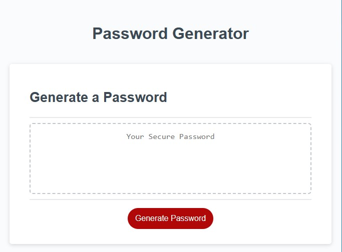

# Password-Generator

## Description

This project is involves random password generating. By clicking on "Generate Password" button, options of different types of symbols will be given. The user can decide what symbols likes to include. The options are lowercase letters, uppercase letters, numbers and special symbols. After confirmation the password will be displayed in the box.

## Screenshots

## Links

- Solution URL: [Solution URL here](https://github.com/KodeIva/Password-Generator)
- Live Site URL: [Live site URL here](https://kodeiva.github.io/Password-Generator/)

## Technologies used

- HTML5
- CSS 
- JavaScript

### JavaScript codes

- if...else statement
- function declaration
- Math.floor()
- Math.random()
- isNaN()
- concat()

## Installation

 N/A

## Credits

N/A

## License
[MIT](https://choosealicense.com/licenses/mit/)
